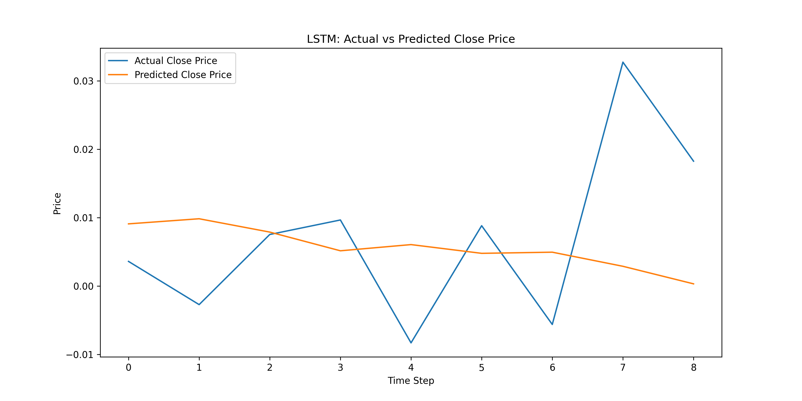

# Tesla Stock Sentiment Analysis & Prediction

This project uses Reddit sentiment + stock metrics to predict TSLA stock returns using an LSTM neural network.

---

## Features
- Scrapes Reddit posts from `/r/teslamotors`
- Analyzes sentiment using FinBERT
- Fetches TSLA stock data from Yahoo Finance
- Trains LSTM model to predict next-day return
- Outputs plots and forecast files

---

## Folder Structure
Stock-Sentiment/
├── data/
│   ├── reddit/                  # FinBERT-labeled Reddit data
│   ├── stocks/                  # TSLA historical stock prices
│   ├── merged/                  # Final merged dataset
│   └── lstm_predictions.csv     # Actual vs predicted returns
├── figures/
│   └── lstm_predictions.png     # Plot of LSTM predictions
├── src/
│   ├── reddit_scraper.py        # Reddit scraping functions
│   ├── stock_data.py            # TSLA data loader
│   ├── finbert_sentiment.py     # FinBERT inference
│   └── lstm_model.py            # LSTM architecture and training
├── run_lstm.py                  # Main LSTM runner
├── report.md                    # Project report
└── README.md                    # This file
---

## Sample Output

---

## Technologies
- Python 3.11
- FinBERT (HuggingFace)
- Keras + TensorFlow (LSTM)
- Pandas, Numpy, Matplotlib
- yfinance, PRAW (Reddit API)

---

## Future Work
- Deploy Streamlit dashboard
- Add binary classifier ("Will stock go up?")
- Compare with other models: Transformer, XGBoost, etc.

---

## 📜 License
MIT License